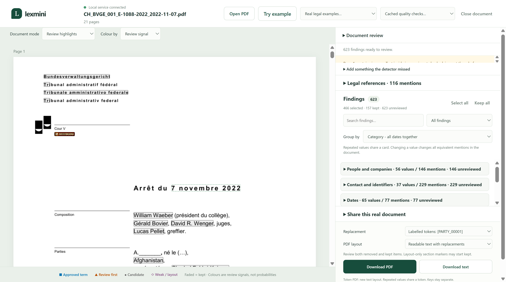
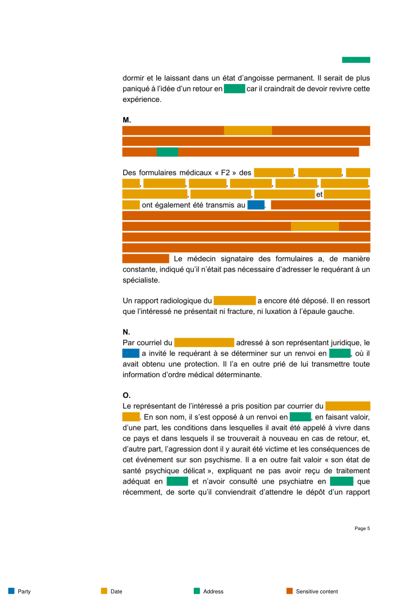

# Lexmini

## [Live Demo](https://lexmini.replit.app)



## Open Lexmini

- **[Documentation](https://lexmini.replit.app/)** - start here for the use case, process and governance design.
- **[Try the Swiss example](https://lexmini.replit.app/assets/review.html?quality=CH_BVGE_001_E-1088-2022_2022-11-07)** - open a real French judgment with saved findings, ready to review.
- **[Upload a PDF](https://lexmini.replit.app/assets/review.html)** - open the review workspace and choose your own document.

## [Watch our presentation](https://drive.google.com/file/d/1oYyn97AnC8AuUX9uYixeoTu65kwLxWij/view)

Built for [the Legal Hackathon at Swiss {ai} Weeks](https://ai-weeks.ch/events/legal-hackathon), 23 September 2026.

**Team:** Jerome Gano, Olga Ilyukhina, Urs Thüring.

A legal translator needs a useful document without private client names, addresses or birthdays. Lexmini finds candidate fields, lets the law firm review removals, and shares a tokenised copy. The firm can permit selected originals for a limited time and revoke future access. Approved party labels improve later screening.



Open **START.html** for the guide and sample PDFs. The reviewed examples illustrate output, not approved final redactions.

<details>
<summary>Track 1 instructions - Data Minimiser</summary>

Transcribed from slide 10 of the organiser’s “Legal Hackathon Slides - Participants” presentation.

> Data Minimiser: AI Assistant for Privacy-by-Design Forms & Flows (hard-coded)
> 
> ### Why
> 
> Data minimisation is one of the core principles of responsible data processing, but it is often difficult to apply in day-to-day product design. This challenge helps teams turn that principle into something tangible: a tool that makes it easier to collect only what is needed, communicate that clearly, and reduce risk from the start. 
> 
> ### The Problem
> 
> Every product, onboarding flow, and internal system collects data, but not every field is necessary. Too often, teams ask for more information than they need, store it for too long, or collect sensitive data without a clear purpose.
> 
> This challenge invites participants to build an AI assistant that helps teams design leaner, safer, and more transparent data collection flows. The goal is to review forms, onboarding journeys, or CRM fields and identify where data minimisation is possible, where sensitive data may be over-collected, and how to explain data use in a clearer, more user-friendly way.
> 
> ### The Solution should
> 
> support product teams, legal/compliance functions, and operations teams by:
> 
> - Flagging unnecessary or overly intrusive fields.
> 
> - Identifying where sensitive or special-category data may be collected.
> 
> - Suggesting simpler alternatives or optional fields.
> 
> - Generating plain-language microcopy that explains why each field is needed.
> 
> - Mapping how collected data flows through systems such as CRM, analytics, support, or third-party tools.
> 
> ### What we’re looking for
> 
> - A prototype that reviews a sample form, flow, or data schema.
> 
> - Clear identification of fields that could be removed, made optional, or better explained.
> 
> - Suggestions for improved wording or data-handling logic.
> 
> - A strong user experience that makes privacy decisions easy to understand.
> 
> - Responsible AI design with human review, transparency, and data minimisation built in.
> 
> The best solutions will not just reduce friction for users, but also help organisations apply privacy-by-design principles in a practical, everyday way.

</details>

## Processing

Docling reads paragraphs and layout. OpenAI Privacy Filter runs on Modal GPU; spaCy and rules add candidates. GPT-6 Sol performs the final structured quality check through Pydantic AI, using standard processing and medium reasoning. Apertus is the planned replacement for that final check.

## Demonstration deadline

OpenAI requests are blocked after **23 October 2026 at 13:52:45 UTC**.

## Run locally

Install Python 3.13 and uv, then run from this folder:

```bash
export UV_CACHE_DIR="$HOME/.cache/uv"
uv sync --frozen
bash scripts/RUN_server.sh
```

Open http://127.0.0.1:8766/assets/review.html. The saved French Swiss example can be reviewed without calling the models. New screening needs the services below.

## Connect your services

1. **Bitwarden:** create a Secrets Manager machine account and an access token. Save the token as `BITWARDEN_ACCESS_TOKEN`.
2. **Modal:** create API credentials and save them as `MODAL_TOKEN_ID` and `MODAL_TOKEN_SECRET`.
3. **OpenAI:** create an API key and save it as `OPENAI_API_KEY`.
4. **Replit:** add the Modal and OpenAI values to Secrets and include them in the deployment. The app reads these fields directly; Bitwarden is where you can manage the originals.

Deploy the two Modal workers:

```bash
uv run modal deploy scripts/RUN_modal_screening.py
uv run modal deploy scripts/RUN_modal_privacy.py
```

## Contents

- src: application and server code.
- extension: document review interface and browser extension.
- scripts: model deployment and data utilities.
- tests: repeatable checks (`uv run python -m unittest discover -s tests`).
- data: public Swiss PDFs, text and saved screening results.
- extension/governance-guide.html: the documentation page.


